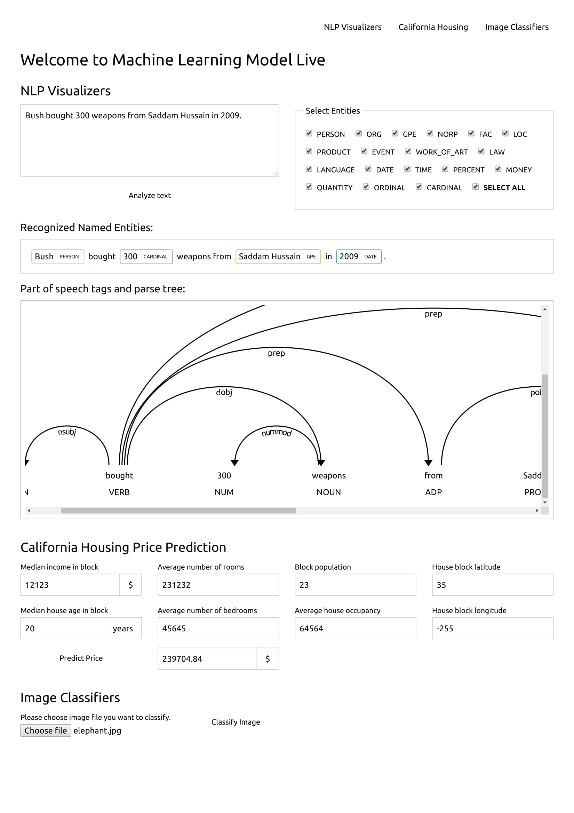
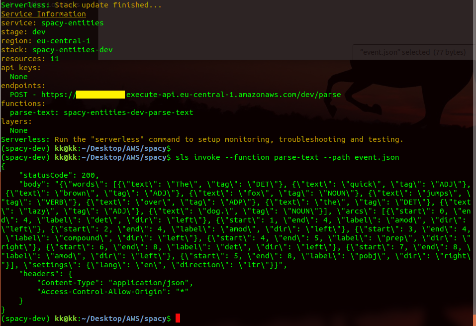
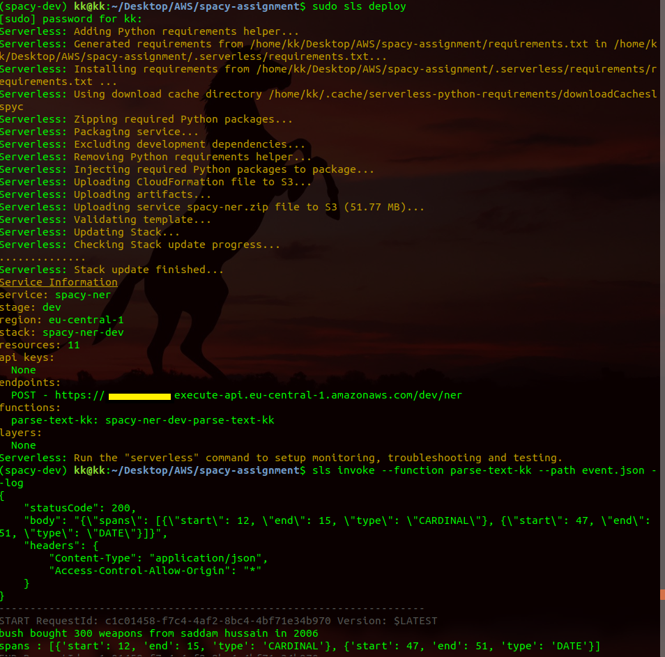
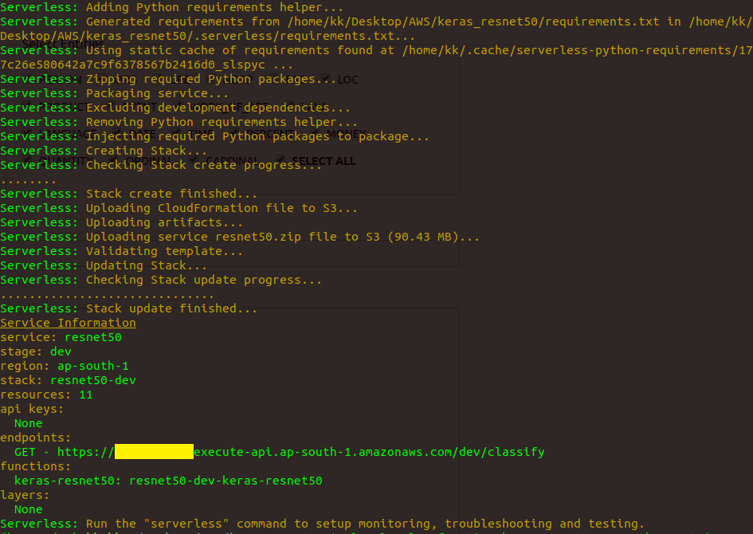

# Welcome to Machine Learning Model Live

[Machine Learning Model Live](https://frount-end.s3.us-east-2.amazonaws.com/index.html)




#download moni-conda
bash Miniconda3-latest-Linux-x86_64.sh

cd..
sudo apt install python3-distutils
wget http://bootstrap.pypa.io/get-pip.py
ls -l # locate get-pip.py in folder

sudo python3.6 get-pip.py
sudo pip3 install testresources

# download docker from https://download.docker.com/linux/ubuntu/dists/bionic/pool/stable/amd64/


#version containerd.io_1.2.4-1_amd64.deb,docker-ce-cli_18.09.3~3-0~ubuntu-bionic_amd64.deb, docker-ce_18.09.3~3-0~ubuntu-bionic_amd64.deb

sudo dpkg -i containerd.io_1.2.4-1_amd64.deb
sudo dpkg -i docker-ce-cli_18.09.3~3-0~ubuntu-bionic_amd64.deb
sudo dpkg -i docker-ce_18.09.3~3-0~ubuntu-bionic_amd64.deb

#start docker atometically
sudo systemctl enable docker
sudo docker run hello-world

#to run serverless (download node from server)
sudo apt install curl
curl -sL https://deb.nodesource.com/setup_10.x -o nodesource_setup.sh
ls -l

sudo bash nodesource_setup.sh
sudo apt install -y nodejs

#check node version 
nodejs -v # v10.17.0
npm -v #(6.11.3)

# install serverless framework
sudo npm install -g serverless

sudo chown -R $USER:$(id -gn $USER) /home/kk/.config #your .config path
serverless

# setup AWS user and download ID and Access key from https://console.aws.amazon.com/iam/home?region=us-east-2#/users$new?step=final&accessKey&userNames=serverlessAI&permissionType=policies&policies=arn:aws:iam::aws:policy%2FAdministratorAccess


sls config credentials --provider aws --key [FNGDGGNGNBKGF] --secret [AVDBJKFKJFK] 

#open hidden file goto .aws folder 
cat credentials

# create hello world application


mkdir hello-world
sls create --template aws-python3 --name hello-service

#check AWS files, then finally deploy
sls deploy
# california-housing

***************************** scikit learn model *******************************************************************


conda create -n scikit-dev python=3.6 pylint rope jupyter
conda activate scikit-dev
conda install scikit-learn=0.20.2 jupyter pandas pyliny rope

sls create --template aws-python3 --name california-housing

sls plugin install -n serverless-python-requirements@4.2.4

sls invoke local --function predict-price --path event.json

sudo sls deploy

#check on responce from server 
sls invoke --function predict-price --path event.json

## Part of speech tags and parse tree

************************ Part of speech tags and parse tree *************************************


conda create -n spacy-dev python=3.6 pylint rope jupyter
conda activate spacy-dev
pip install spacy

# Download spacy model


python -m spacy download en_core_web_sm

sls create --template aws-python3 --name spacy-entities

sls plugin install -n serverless-python-requirements@4.2.4

sls invoke local --function parse-text --path event.json

sudo sls deploy

sls invoke --function parse-text --path event.json --log



## Recognized Named Entities

*************************** Recognized Named Entities****************************************************************

cd spacy-assignment
conda activate spacy-dev
sls invoke local --function parse-text-kk --path event.json
sls deploy
sls invoke --function parse-text-kk --path event.json --log



##  keras-resnet50

****************************** keras-resnet50 ***********************************************************************

conda create -n keras-dev python=3.6 pylint rope jupyter

conda activate keras-dev

pip install tensorflow==1.12.0 keras==2.2.4 boto3 pillow
#check tensorflow and open notebook to that env
/home/kk/anaconda/envs/keras-dev/bin/jupyter notebook

sls create --template aws-python3 --name resnet50

sls plugin install -n serverless-python-requirements@4.2.4

#sls invoke local --function resnet50-classify --path event.json
sls invoke local --function keras-resnet50 --path event.json --log




# create deployment env
conda create -n keras-deploy python=3.6
conda activate keras-deploy
pip install tensorflow==1.12.0 keras==2.2.4

**copy tensorflow and PIL foler form this new env.

# to check which package need to upload
sudo sls package

check packege size should be around 90MB

# check before deploy
sudo sls deploy

sls invoke --function resnet50-classify --path event.json --log


## keras-inceptionv3

****************************** keras-inceptionv3********************************************************************

conda create -n keras-inception python=3.6 pylint rope jupyter

conda activate keras-inception
pip install tensorflow==1.12.0 keras==2.2.4 boto3 pillow

sls create --template aws-python3 --name inception

sls plugin install -n serverless-python-requirements@4.2.4

sls invoke local --function keras-inceptionv3 --path event.json --log

sudo sls deploy

sls invoke --function keras-inceptionv3 --path event.json --log


****************************** Test*********************************************************************************


```
{
    "Version": "2012-10-17",
    "Statement": [
        {
            "Effect":"Allow",
            "Action":[  
                "s3:*"
                ],
            "Resource":[
                "arn:aws:s3:::[Bucket_name]/*"
                ]
        }
        ]
}
```
## licence certification as for AWS policy


```
<?xml version="1.0" encoding="UTF-8"?>
<CORSConfiguration xmlns="http://s3.amazonaws.com/doc/2006-03-01/">
 <CORSRule>
   <AllowedOrigin>*</AllowedOrigin>
   <AllowedMethod>GET</AllowedMethod>
   <AllowedMethod>PUT</AllowedMethod>
   <AllowedMethod>POST</AllowedMethod>
   <AllowedMethod>DELETE</AllowedMethod>
   <AllowedMethod>HEAD</AllowedMethod>
   <AllowedHeader>*</AllowedHeader>
 </CORSRule>
</CORSConfiguration>
```


link: https://frount-end.s3.us-east-2.amazonaws.com/index.html

code : https://www.youtube.com/watch?v=mLp-zeXOsDE&feature=emb_title

## NLP Example.

The quick brown fox jumps over the lazy dog.
Bush bought 300 weapons from Saddam Hussain in 2009.

# NLP parse fun()


```
def tag_and_parse(text):
    doc = MODEL(text)
    spans = list()
    for token in doc:
        span = {'start': token.start_char,
                'end'  : token.end_char,
                'type' : token.label_
                }
        spans.append(span)
    return spans


 def tag_and_parse(text):
    doc = MODEL(text)
    return displacy.parse_deps(doc)
```
