###  How GANs work? 

 

One neural network, called the generator, generates new data instances, while the other, the discriminator, evaluates them for authenticity; i.e. the discriminator decides whether each instance of data that it review belongs to the actual training dataset or now. 

 

Let’s say we’re trying to do something banaler than mimic the Mona Lisa. We’re going to generate hand-written numerals like those found in the MNIST dataset, which is taken from the real world. The goal of the discriminator, when shown an instance from the true MNIST dataset, is to recognize those that are authentic.

 

Meanwhile, the generator is creating new, synthetic images that it passes to the discriminator. It does so in the hopes that they, too, will be deemed authentic, even though they are fake. The goal of the generator is to generate passable hand-written digits: to lie without being caught. The goal of the discriminator is to identify images coming from the generator as fake.

 

 

 

 

Here are the steps a GAN takes:

- The generator takes in random numbers and returns an image
- This generated image is fed into the discriminator alongside a stream of images taken from the actual, ground-truth dataset
- The discriminator takes in both real and fake images and returns values between 0 and 1, with 1 representing a prediction of authenticity and 0 representing a fake. 

 

So you have a double feedback loop:

- The discriminator is in a feedback loop with the ground truth of the images, which we know.
- The generator is in a feedback loop with the discriminator.

 

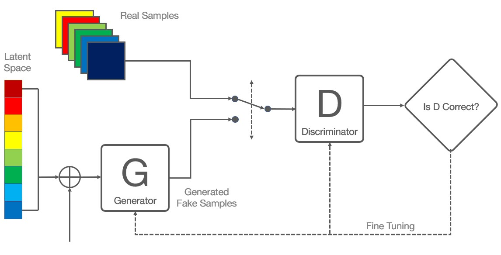

 

 

Actual Example:

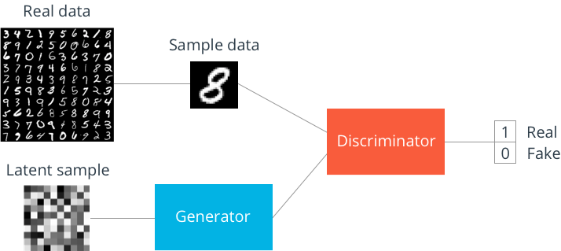

 

Real and Fake are values 1 and 0. We are targeting 0.5. 

You can think of a GAN as the opposition of a counterfeiter and a cop in a game of cat and mouse, where the counterfeiter is learning to pass false notes, and the cop is learning to detect them. Both are dynamic; i.e. the cop is in training, too (to extend the analogy, maybe the central bank is flagging bills that slipped through), and each side comes to learn the other’s methods in a constant escalation.

Let us consider MNIST

For MNIST, the discriminator network is a standard convolution network that can categorize the images fed to it, a binomial classifier labeling images as real or fake. 

The generator is an **inverse convolution network**. While a standard convolution classifier takes an image and down-samples it to produce a soft-max number, the generator model takes a vector of random noise and up-samples it to an image. 

The first throws away the data through down-sampling techniques like max-pooling, and the second generates new data. 

**Both networks are trying to optimize a different and opposing objective function, or loss function, in a zero-sum game.** This is essentially an actor-critic model. As the discriminator changes its behavior, so does the generator, and vice versa. Their losses push against each other.

 

Our Discriminator and Generator can take many DNN forms, most of which we already are aware of:

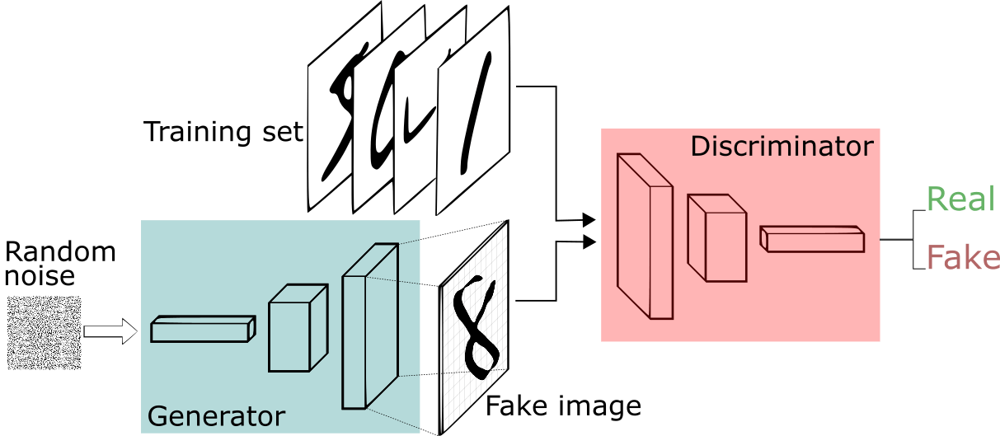

 

 

 

###  GANs, Autoencoders and VAEs 

 

It may be useful to compare generative adversarial networks to other neural networks, such as autoencoders and variational autoencoders.

 

**Autoencoders** encode input data as vectors. They create a hidden or compressed representation of the raw data. They are useful in dimensionality reduction; that is, the vector serving as a hidden representation compresses the raw data into a smaller number of salient dimensions. Autoencoders can be paired with a decoder, which allows you to reconstruct input data based on its hidden representation.

 

 

**Variational Autoencoders** are generative algorithms that add an additional constraint to encode the input data, namely that the hidden representations are normalized. VAEs are capable of both compressing data like an autoencoder and synthesizing data like a GAN. However, while GANs generate data in fine, granular details, images generated by VAEs tend to be more blurred (this statement changed on [9 June 2019](https://arxiv.org/pdf/1906.00446.pdf)

| result at 1st epoch |  result at 100 epoch  |
| :-----------------: | :-------------------: |
| 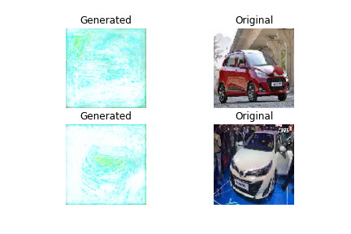 | 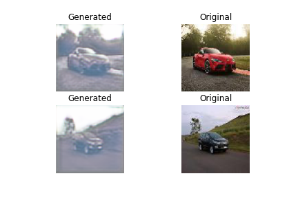 |

|  result at 150 epoch  |  result at 200 epoch  |
| :-------------------: | :-------------------: |
| 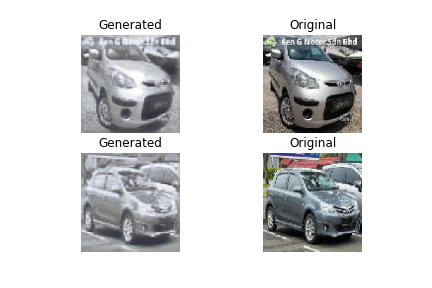 | 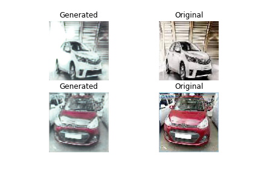 |

|  result at 250 epoch  |  result at 1st epoch  |
| :-------------------: | :-------------------: |
| 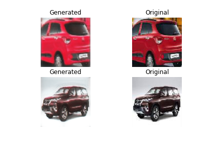 | 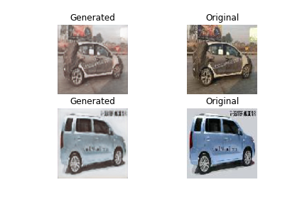 |

|  result at 350 epoch  |  result at 550 epoch  |
| :-------------------: | :-------------------: |
| 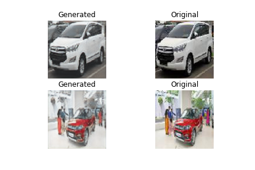 | 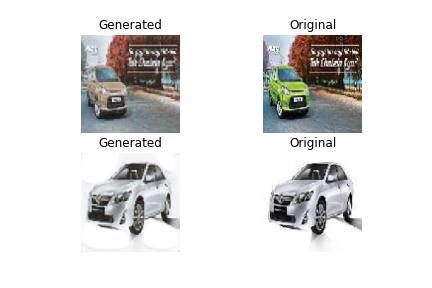 |

|  result at 1140 epoch  |  result at 1450 epoch  |
| :--------------------: | :--------------------: |
| 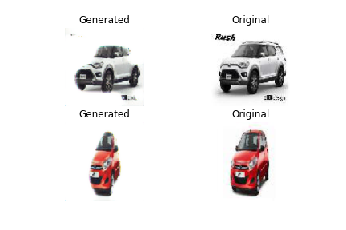 | 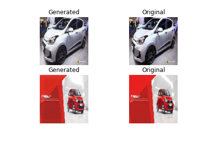 |

Coming back to GAN

When you train the discriminator, hold the generator values constant, and when you train the generator, hold the discriminator constant. You need to train the discriminator first. You also need to train the discriminator more than the generator. 

Each side of the GAN can overpower the other. If the discriminator is too good, it will return values so close to 0 or 1, that the generator will struggle to read the gradient. If the generator is too good, it will persistently exploit a weakness in the discriminator that lead to false negatives. This may be mitigated by their respective learning rates. 

GANs take a long time to train. On a single GPU a GAN might take hours and on a single CPU more than a day. 

 

Let's understand GANs through a code:

[CODE](https://github.com/eriklindernoren/Keras-GAN/blob/master/gan/gan.py)

Output of simple GAN

|            result at 20 epoch            |            result at 360 epoch            |
| :--------------------------------------: | :---------------------------------------: |
| 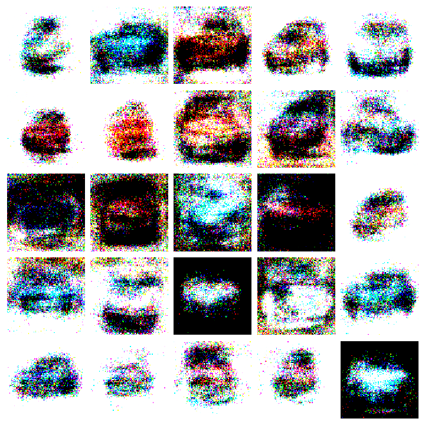 |  |

